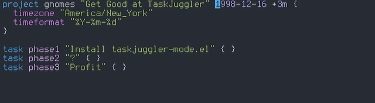
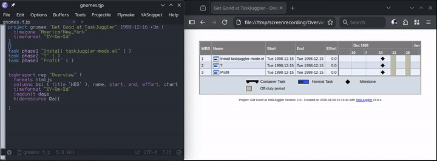
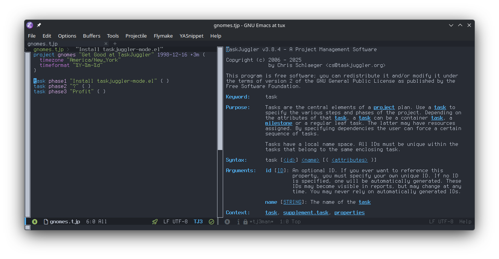
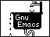

# taskjuggler-mode.el

[](https://melpa.org/#/taskjuggler-mode)

An Emacs major mode for editing [TaskJuggler v3](https://taskjuggler.org)
project files (`.tjp`, `.tji`).

If you are already at the point that you are using (or considering)
TaskJuggler, then you are *deep* down the rabbit hole and I wish you
good luck. I also offer you this package to help.


Here's what this mode provides, out of the box, with no dependencies:

- Syntax highlighting and automatic indentation
- Helpful inline calendar picker for date entry
- Live task highlighting in the browser
- `tj3man` documentation lookup
- Compilation and `flymake` support
- s-expression movement

Evil mode bindings are provided for all of us on the dark side. If you
use `yasnippet`, several templates are included — see the
[yasnippet snippets](#yasnippet-snippets) section for setup.

## Requirements

- Emacs 27.1 or later
- [TaskJuggler](https://taskjuggler.org/) `tj3` and `tj3man` for compilation, flymake, and man page features

Optional:
- [yasnippet](https://github.com/joaotavora/yasnippet) (call `taskjuggler-mode-snippets-initialize` after yasnippet loads to register snippets)

## Features

### Inline calendar picker

`C-c C-t d` (`taskjuggler-mode-date-dwim`) pops ups a calendar under point
for working with TJ3 dates:



The calendar appears as an overlay below the current line. The
calendar updates as you type the YYYY-MM-DD date, or navigate the
selected date with shift-arrows (`S-<right>`/`S-<left>` by day,
`S-<up>`/`S-<down>` by week, or `S-<prior>`/`S-<next>` by
month). Press `RET` or `TAB` to confirm, `C-g` to cancel.

### Live task highlighting

If you're using my [`jsgantt` branch of TaskJuggler](https://github.com/devrintalen/TaskJuggler/tree/jsgantt), 
then you can easily see the task you're editing in the browser.



How it works:

1. Use the `format htmljs` attribute in the report definiton to get the interactive chart.
2. Compile the project with `tj3` as usual.
3. Open the generated report in a browser.
4. Edit the `.tjp/i` file in Emacs. The chart row for the task at point is
   highlighted automatically as the cursor moves.

Tracking starts automatically when a `.tjp` file is opened and stops (writing
`null`) when the buffer is killed. It is disabled if the `js/` directory does not
exist, and can be turned off entirely by setting `taskjuggler-mode-cursor-idle-delay`
to `nil`.

The sidecar file is written as a JS assignment (`window._tjCursorTaskId = "…"`)
rather than JSON so the browser can load it via a `<script>` tag, which works
under `file://` without CORS restrictions.

### tj3man integration

`C-c C-t m` (`taskjuggler-mode-man`) shows the TJ3 manual entry for a keyword:



- Prompts with completion over all known TJ3 keywords.
- Defaults to the word at point, so placing the cursor on a keyword and
  pressing `C-c C-t m RET` shows its documentation immediately.
- Output is shown in a `*tj3man*` help window (press `q` to dismiss).
- Uses syntax highlighting to make the pages easier to read.
- Hyperlinks used to jump to related pages.

`tj3man` is resolved via `taskjuggler-mode-tj3-bin-dir`.

### Syntax highlighting and indentation

Highlighting for keywords, IDs, strings, etc., just like you would
expect. Even TaskJuggler's unique scissor strings `"-8<-...->8-"` are
parsed correctly as multi-line strings.

`M-;` (`comment-dwim`) and `comment-region` default to `#` style. All three
styles are recognized by `forward-comment`, `comment-search-forward`, and
similar navigation commands.

- `TAB` indents the current line (`taskjuggler-mode-indent-line`).
- `C-M-\` indents the active region (`taskjuggler-mode-indent-region`).
- Tabs are never inserted; `indent-tabs-mode` is `nil`.

### Block movement

| Key        | Command                       | Description                                   |
|------------|-------------------------------|-----------------------------------------------|
| `M-<up>`   | `taskjuggler-mode-move-block-up`   | Swap block at point with its previous sibling |
| `M-<down>` | `taskjuggler-mode-move-block-down` | Swap block at point with its next sibling     |

- Any comment lines (`#` or `//`) immediately preceding a block header (with
  no intervening blank lines) travel with the block.
- The blank-line separator between the two blocks is preserved.
- Works from anywhere inside a block, not just on the header line.

### Block navigation

Several commands let you move through the block structure without the mouse:

| Key        | Command                             | Description                                           |
|------------|-------------------------------------|-------------------------------------------------------|
| `C-M-f`    | `forward-sexp`                      | Skip forward over one block as a unit (sexp)          |
| `C-M-b`    | `backward-sexp`                     | Skip backward over one block as a unit (sexp)         |
| `C-M-n`    | `taskjuggler-mode-next-block`            | Jump to the next *sibling* at the same depth          |
| `C-M-p`    | `taskjuggler-mode-prev-block`            | Jump to the previous *sibling* at the same depth      |
| `C-M-u`    | `taskjuggler-mode-goto-parent`           | Jump to the enclosing block's header                  |
| `C-M-d`    | `taskjuggler-mode-goto-first-child`      | Jump to the first direct child block                  |
| `C-M-a`    | `beginning-of-defun`                | Jump to the header of the current/enclosing block     |
| `C-M-e`    | `end-of-defun`                      | Jump past the closing `}` of the current block        |
| `C-M-h`    | `taskjuggler-mode-mark-block`            | Mark the current block as a region (incl. comments)   |
| —          | `taskjuggler-mode-forward-block`         | Linear scan to the next block header (any depth)      |
| —          | `taskjuggler-mode-backward-block`        | Linear scan to the previous block header (any depth)  |
| —          | `taskjuggler-mode-goto-last-child`       | Jump to the last direct child block                   |

`narrow-to-defun` also works as expected (via the defun integration).

### Block editing

| Key        | Command                             | Description                                           |
|------------|-------------------------------------|-------------------------------------------------------|
| `C-M-h`    | `taskjuggler-mode-mark-block`            | Select the current block as the active region         |
| `C-x n b`  | `taskjuggler-mode-narrow-to-block`       | Narrow the buffer to the current block                |
| —          | `taskjuggler-mode-clone-block`           | Duplicate the current block immediately after itself  |

- `taskjuggler-mode-mark-block` places point at the start of any immediately
  preceding comment lines and mark at the end of the closing `}`.
- `taskjuggler-mode-narrow-to-block` narrows from the header line through the
  closing `}`; use `C-x n w` to widen again.
- `taskjuggler-mode-clone-block` inserts a copy of the current block (including
  preceding comments) immediately after it with a blank-line separator and
  leaves point on the clone's header line.

### Evil-mode bindings

When `evil-mode` is active, additional normal-state bindings are registered:

| Key   | Command                             |
|-------|-------------------------------------|
| `gj`  | `taskjuggler-mode-next-block`            |
| `gk`  | `taskjuggler-mode-prev-block`            |
| `gh`  | `taskjuggler-mode-goto-parent`           |
| `gl`  | `taskjuggler-mode-goto-first-child`      |
| `gL`  | `taskjuggler-mode-goto-last-child`       |
| `]t`  | `taskjuggler-mode-forward-block-sexp`    |
| `[t`  | `taskjuggler-mode-backward-block-sexp`   |
| `]B`  | `taskjuggler-mode-forward-block`         |
| `[B`  | `taskjuggler-mode-backward-block`        |
| `[[`  | `beginning-of-defun`                |
| `]]`  | `end-of-defun`                      |

These bindings are registered with `with-eval-after-load 'evil` so the mode
loads cleanly without evil present.

### Command prefix (`C-c C-t`)

Mode-specific commands are grouped under the `C-c C-t` prefix:

| Key         | Command                       | Description                        |
|-------------|-------------------------------|------------------------------------|
| `C-c C-t d` | `taskjuggler-mode-date-dwim`       | Insert or edit a date at point     |
| `C-c C-t m` | `taskjuggler-mode-man`             | Look up a TJ3 keyword in tj3man    |
| `C-c C-t n` | `taskjuggler-mode-narrow-to-block` | Narrow buffer to the current block |

### Compilation support

The mode supports the standard `compile-command` features. If `tj3` is
not in `PATH`, then customize `taskjuggler-mode-tj3-bin-dir` with the
directory containing the binary. This will then get used for all
compilation and tj3man support.

When you open a `.tjp` file, `compile-command` is pre-filled with
`tj3 <filename>`, so `M-x compile` (or `C-c C-c` if bound) immediately
runs the scheduler on the current file.

TJ3's error format (`filename.tjp:LINE: Error: message`) is registered with
`compilation-error-regexp-alist`, so `next-error` / `previous-error` (`M-g n` /
`M-g p`) jump directly to the offending line. The regexp matches with or without
ANSI color codes so errors are found whether or not
`ansi-color-compilation-filter` is active.

### Flymake integration

The Flymake backend runs `tj3` on the **saved file** whenever Flymake
checks the buffer and reports errors as inline diagnostics. Errors in
included `.tji` files are reported in those files' own buffers rather
than in the parent `.tjp` buffer, matching TJ3's output behavior.

When tj3d owns the current project (see [Daemon
integration](#daemon-integration) below), Flymake instead reports the
diagnostics cached from the last `tj3client add` run — no extra `tj3`
invocation per check.

### Daemon integration

The mode can drive the tj3d scheduling daemon and tj3webd web server
directly. Running tj3d makes Flymake free (diagnostics come from the
daemon's own re-scheduling), and running tj3webd lets the browser-side
report stay in sync with point.

| Key         | Command                                  | Description                                           |
|-------------|------------------------------------------|-------------------------------------------------------|
| `C-c C-t D` | `taskjuggler-mode-tj3d-start`            | Start tj3d in `--auto-update` mode                    |
| `C-c C-t a` | `taskjuggler-mode-tj3d-add-project`      | Add the current project to tj3d                       |
| `C-c C-t W` | `taskjuggler-mode-tj3webd-start`         | Start tj3webd on `taskjuggler-mode-tj3webd-port`      |
| `C-c C-t b` | `taskjuggler-mode-tj3webd-browse`        | Open the tj3webd index page in your browser           |
| `C-c C-t s` | `taskjuggler-mode-daemon-status`         | Echo the live state of both daemons                   |
| —           | `taskjuggler-mode-tj3d-stop`             | Stop tj3d                                             |
| —           | `taskjuggler-mode-tj3webd-stop`          | Stop tj3webd via its pidfile                          |

Set `taskjuggler-mode-auto-start-tj3d-tj3webd` to start the daemons
automatically on mode activation, and
`taskjuggler-mode-auto-add-project-tj3d` to register the project file
once tj3d is running.

### yasnippet snippets

To enable snippets, call `taskjuggler-mode-snippets-initialize` after
yasnippet loads.  Add this to your config:

```emacs-lisp
(with-eval-after-load 'yasnippet
  (taskjuggler-mode-snippets-initialize))
```

The following snippet templates are available:

| Key      | Expands to                                                                              |
|----------|-----------------------------------------------------------------------------------------|
| `proj`   | `project` block with timezone, timeformat, currency, now, and a scenario                |
| `task`   | `task` block with effort, depends, and allocate                                         |
| `mil`    | Milestone task skeleton                                                                 |
| `res`    | Single `resource` block                                                                 |
| `resgrp` | `resource` group containing two members                                                 |
| `dep`    | `depends` line                                                                          |
| `inc`    | `include` statement                                                                     |
| `mac`    | `macro` definition                                                                      |
| `sci`    | TJ3 scissor delimiters (`-8<-` … `->8-`)                                                |
| `je`     | `journalentry` block with author, alert, summary, and details; date pre-filled to today |
| `trep`   | `taskreport` with standard columns                                                      |
| `rrep`   | `resourcereport` with standard columns                                                  |

## Installation

Note that all of these assume your `tj3` and `tj3man` programs are
located at `~/bin`, adjust this path to where they are on your system.

### MELPA (recommended)

Add MELPA to your package archives if you haven't already, then install:

```emacs-lisp
(require 'package)
(add-to-list 'package-archives '("melpa" . "https://melpa.org/packages/") t)
(package-initialize)
```

```
M-x package-install RET taskjuggler-mode RET
```

Or with `use-package`:

```emacs-lisp
(use-package taskjuggler-mode
  :ensure t
  :mode (("\\.tj[ip]\\'" . taskjuggler-mode))
  :hook (taskjuggler-mode . flymake-mode)
  :custom
  (taskjuggler-mode-tj3-bin-dir "~/bin"))
```

### `straight.el` with `use-package`

```emacs-lisp
(use-package taskjuggler-mode
  :straight t
  :mode (("\\.tj[ip]\\'" . taskjuggler-mode))
  :hook (taskjuggler-mode . flymake-mode)
  :custom
  (taskjuggler-mode-tj3-bin-dir "~/bin"))
```

### `use-package` with `:vc` (Emacs 30+)

Built-in, no extra package manager needed.

```emacs-lisp
(use-package taskjuggler-mode
  :vc (:url "https://github.com/devrintalen/taskjuggler-mode.el"
       :rev :newest)
  :mode (("\\.tj[ip]\\'" . taskjuggler-mode))
  :hook (taskjuggler-mode . flymake-mode)
  :custom
  (taskjuggler-mode-tj3-bin-dir "~/bin"))
```

### Manual

```sh
git clone https://github.com/devrintalen/taskjuggler-mode.el ~/.emacs.d/taskjuggler-mode.el
```

```emacs-lisp
(add-to-list 'load-path "~/.emacs.d/taskjuggler-mode.el")
(require 'taskjuggler-mode)
```

## Configuration

All options belong to the `taskjuggler` customization group (`M-x customize-group
RET taskjuggler RET`). The table below lists every option with its default value.

| Option                                          | Default | Description                                                                      |
|-------------------------------------------------|---------|----------------------------------------------------------------------------------|
| `taskjuggler-mode-indent-level`                 | `2`     | Spaces per indentation level                                                     |
| `taskjuggler-mode-tj3-bin-dir`                  | `nil`   | Directory containing `tj3` and `tj3man`, or nil for PATH                         |
| `taskjuggler-mode-tj3-extra-args`               | `nil`   | Extra CLI flags forwarded to `tj3` by the Flymake backend                        |
| `taskjuggler-mode-cursor-idle-delay`            | `0.3`   | Idle seconds before syncing the cursor; set to `nil` to disable cursor tracking  |
| `taskjuggler-mode-cal-show-week-numbers`        | `nil`   | When non-nil, show ISO week-number labels (e.g. `WW15`) in the calendar popup    |
| `taskjuggler-mode-auto-cal-on-date-keyword`     | `nil`   | When non-nil, open the calendar popup after typing a date keyword and a space    |
| `taskjuggler-mode-tj3webd-port`                 | `8080`  | Port for the tj3webd web server (used by `--port` and the browse URL)            |
| `taskjuggler-mode-auto-start-tj3d-tj3webd`      | `nil`   | When non-nil, start tj3d and tj3webd when the mode activates                     |
| `taskjuggler-mode-auto-add-project-tj3d`        | `nil`   | When non-nil, add the current project to a running tj3d when the mode activates  |

`taskjuggler-mode-tj3-extra-args` is buffer-local safe (`listp`), so you can set it
per-project with a `.dir-locals.el`:

```emacs-lisp
;; .dir-locals.el
((taskjuggler-mode
  . ((taskjuggler-mode-tj3-bin-dir    . "/opt/myproject/tj3/bin")
     (taskjuggler-mode-tj3-extra-args . ("--prefix" "/opt/myproject/tj3")))))
```

## Other Options

This is not the first Emacs mode written to support TaskJuggler. As
far as I know, these are the projects already out there:

| **Project**                 | **Notes**                                                                                               |
|-----------------------------|---------------------------------------------------------------------------------------------------------|
| csrhodes/tj3-mode           | Provides syntax highlighting                                                                            |
| ska2342/taskjuggler-mode.el | Probably the "original" Emacs mode for TaskJuggler. Written for TJ2 and once packaged with TaskJuggler. |
| ox-taskjuggler              | org export backend, turns org-mode documents into TaskJuggler files.                                    |
| ndwarshuis/org-tj           | Library funtions for org-mode and TaskJuggler integration                                               |

Here's how this one differs:

- Full TJ3 keyword coverage across four semantic categories (structural,
  report, property, value)
- All three TJ3 comment styles (`//`, `/* */`, `#`) handled correctly
- `syntax-ppss`-based indentation that understands `{}` and `[]` nesting,
  including continuation-line alignment for comma-terminated argument lists
- Inline calendar picker for date literals (`C-c C-t d`) — inserts a new
  date or edits the date under point
- `tj3man` keyword documentation lookup (`C-c C-t m`) with completion
- First-class Flymake integration running `tj3` on-the-fly
- `compilation-mode` error navigation pre-wired for TJ3's error format
- yasnippet snippet collection for common constructs
- Block movement (`M-<up>` / `M-<down>`) swaps sibling blocks while
  keeping their preceding comments attached
- Block navigation: jump to next/previous sibling, parent, and first/last
  child; linear forward/backward scan across nesting boundaries
- `beginning-of-defun` / `end-of-defun` integration (`C-M-a` / `C-M-e`)
- Block editing: mark block with comments (`C-M-h`), narrow to block (`C-x n b`),
  clone block
- Evil-mode bindings for all block navigation commands


