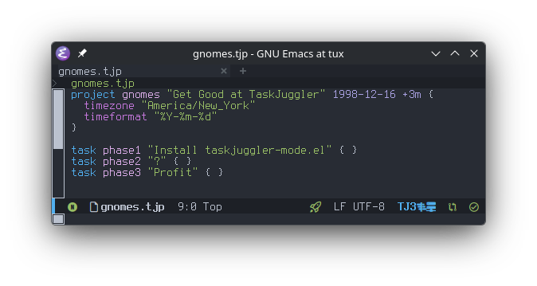

# taskjuggler-mode.el

An Emacs major mode for editing [TaskJuggler v3](https://taskjuggler.org)
project files (`.tjp`, `.tji`).

If you are already at the point that you are using (or considering)
TaskJuggler, then you are *deep* down the rabbit hole and I wish you
good luck. I also offer you this package to help.



## Features

### Highlights

- Syntax highlighting
- Indentation support
- s-expression movement
- Evil-mode bindings
- Compilation and `flymake` support
- `tj3man` keyword documentation (`C-c C-t m`)
- snippets (if `yasnippet` is present)
- inline calendar picker for date literals (`C-c C-t d`)

Details on the features follow below.

### Syntax highlighting

Keywords are divided into four semantic categories, each mapped to a
distinct face so themes can style them independently:

| Category                | Face                                                              | Examples                                          |
|-------------------------|-------------------------------------------------------------------|---------------------------------------------------|
| Structural keywords     | `font-lock-keyword-face`                                          | `project`, `task`, `resource`, `include`, `macro` |
| Report keywords         | `font-lock-builtin-face`                                          | `taskreport`, `resourcereport`, `textreport`      |
| Property keywords       | `font-lock-type-face`                                             | `effort`, `depends`, `allocate`, `start`, `end`   |
| Value/constant keywords | `font-lock-constant-face`                                         | `asap`, `alap`, `yes`, `no`, `done`               |
| Declaration identifiers | `font-lock-function-name-face`                                    | The `my-task` in `task my-task "…"`               |
| Date literals           | `taskjuggler-date-face` (inherits `font-lock-string-face`)        | `2024-03-15`, `2024-03-15-09:00`                  |
| Duration literals       | `taskjuggler-duration-face` (inherits `font-lock-constant-face`)  | `5d`, `2.5h`, `3w`, `30min`                       |
| Macro/env references    | `taskjuggler-macro-face` (inherits `font-lock-preprocessor-face`) | `${MacroName}`, `$(ENV_VAR)`                      |
| Strings                 | `font-lock-string-face`                                           | `"Project Name"`                                  |
| Comments                | `font-lock-comment-face`                                          | `// …`, `/* … */`, `# …`                          |

All three TJ3 comment syntaxes are recognized for navigation and toggling:

- `//` — line comment
- `/* … */` — block comment
- `#` — line comment (handled via `syntax-propertize-rules` to avoid conflicting
  with `$` in macro references)

`M-;` (`comment-dwim`) and `comment-region` default to `#` style. All three
styles are recognized by `forward-comment`, `comment-search-forward`, and
similar navigation commands.

### Indentation

Indentation is brace/bracket depth–based, computed with `syntax-ppss` so it is
aware of strings and comments:

- Each `{` or `[` increases the indent by `taskjuggler-indent-level` spaces.
- A line that starts with `}` or `]` is de-indented one level relative to the
  surrounding block.
- `TAB` indents the current line (`taskjuggler-indent-line`).
- `C-M-\` indents the active region (`taskjuggler-indent-region`).
- Tabs are never inserted; `indent-tabs-mode` is `nil`.
- Continuation lines (when the previous non-blank line ends with a comma) are
  aligned with the first argument on the keyword line rather than indented by
  one level.

### Block movement

| Key        | Command                       | Description                                   |
|------------|-------------------------------|-----------------------------------------------|
| `M-<up>`   | `taskjuggler-move-block-up`   | Swap block at point with its previous sibling |
| `M-<down>` | `taskjuggler-move-block-down` | Swap block at point with its next sibling     |

- Any comment lines (`#` or `//`) immediately preceding a block header (with
  no intervening blank lines) travel with the block.
- The blank-line separator between the two blocks is preserved.
- Works from anywhere inside a block, not just on the header line.

### Block navigation

Several commands let you move through the block structure without the mouse:

| Key        | Command                             | Description                                           |
|------------|-------------------------------------|-------------------------------------------------------|
| `C-M-f`    | `forward-sexp`                      | Skip forward over one block as a unit (sexp)          |
| `C-M-b`    | `backward-sexp`                     | Skip backward over one block as a unit (sexp)         |
| `C-M-n`    | `taskjuggler-next-block`            | Jump to the next *sibling* at the same depth          |
| `C-M-p`    | `taskjuggler-prev-block`            | Jump to the previous *sibling* at the same depth      |
| `C-M-u`    | `taskjuggler-goto-parent`           | Jump to the enclosing block's header                  |
| `C-M-d`    | `taskjuggler-goto-first-child`      | Jump to the first direct child block                  |
| `C-M-a`    | `beginning-of-defun`                | Jump to the header of the current/enclosing block     |
| `C-M-e`    | `end-of-defun`                      | Jump past the closing `}` of the current block        |
| `C-M-h`    | `taskjuggler-mark-block`            | Mark the current block as a region (incl. comments)   |
| —          | `taskjuggler-forward-block`         | Linear scan to the next block header (any depth)      |
| —          | `taskjuggler-backward-block`        | Linear scan to the previous block header (any depth)  |
| —          | `taskjuggler-goto-last-child`       | Jump to the last direct child block                   |

`narrow-to-defun` also works as expected (via the defun integration).

### Block editing

| Key        | Command                             | Description                                           |
|------------|-------------------------------------|-------------------------------------------------------|
| `C-M-h`    | `taskjuggler-mark-block`            | Select the current block as the active region         |
| `C-x n b`  | `taskjuggler-narrow-to-block`       | Narrow the buffer to the current block                |
| —          | `taskjuggler-clone-block`           | Duplicate the current block immediately after itself  |

- `taskjuggler-mark-block` places point at the start of any immediately
  preceding comment lines and mark at the end of the closing `}`.
- `taskjuggler-narrow-to-block` narrows from the header line through the
  closing `}`; use `C-x n w` to widen again.
- `taskjuggler-clone-block` inserts a copy of the current block (including
  preceding comments) immediately after it with a blank-line separator and
  leaves point on the clone's header line.

### Evil-mode bindings

When `evil-mode` is active, additional normal-state bindings are registered:

| Key   | Command                             |
|-------|-------------------------------------|
| `gj`  | `taskjuggler-next-block`            |
| `gk`  | `taskjuggler-prev-block`            |
| `gh`  | `taskjuggler-goto-parent`           |
| `gl`  | `taskjuggler-goto-first-child`      |
| `gL`  | `taskjuggler-goto-last-child`       |
| `]t`  | `taskjuggler-forward-block-sexp`    |
| `[t`  | `taskjuggler-backward-block-sexp`   |
| `]B`  | `taskjuggler-forward-block`         |
| `[B`  | `taskjuggler-backward-block`        |
| `[[`  | `beginning-of-defun`                |
| `]]`  | `end-of-defun`                      |

These bindings are registered with `with-eval-after-load 'evil` so the mode
loads cleanly without evil present.

### Command prefix (`C-c C-t`)

Mode-specific commands are grouped under the `C-c C-t` prefix:

| Key           | Command                    | Description                        |
|---------------|----------------------------|------------------------------------|
| `C-c C-t d`   | `taskjuggler-date-dwim`    | Insert or edit a date at point     |
| `C-c C-t m`   | `taskjuggler-man`          | Look up a TJ3 keyword in tj3man    |
| `C-c C-t n`   | `taskjuggler-narrow-to-block` | Narrow buffer to the current block |

### Date editing

`C-c C-t d` (`taskjuggler-date-dwim`) is a unified entry point for working with
TJ3 date literals:

- **Point is on a date**: opens an inline calendar overlay pre-filled with the
  existing date so you can edit it in place.
- **Point is not on a date**: inserts today's date and opens the calendar.

The calendar appears as an overlay below the current line. Navigate the selected
date with Shift-arrows (`S-<right>`/`S-<left>` by day, `S-<up>`/`S-<down>` by
week, `S-<prior>`/`S-<next>` by month), or type a date directly in `YYYY-MM-DD`
format. Press `RET` or `TAB` to confirm, `C-g` to cancel.

No Org dependency — the calendar is built into the mode.

### tj3man integration

`C-c C-t m` (`taskjuggler-man`) shows the TJ3 manual entry for a keyword:

- Prompts with completion over all known TJ3 keywords.
- Defaults to the word at point, so placing the cursor on a keyword and
  pressing `C-c C-t m RET` shows its documentation immediately.
- Output is shown in a `*tj3man*` help window (press `q` to dismiss).

`tj3man` is resolved via `taskjuggler-tj3-bin-dir` just like `tj3`.

### Compilation support

The mode supports the standard `compile-command` features. If `tj3` is
not in `PATH`, then customize `taskjuggler-tj3-bin-dir` with the
directory containing the binary. This will then get used for all
compilation and tj3man support.

When you open a `.tjp` file, `compile-command` is pre-filled with
`<taskjuggler-tj3-program> <filename>`, so `M-x compile` (or `C-c C-c`
if bound) immediately runs the scheduler on the current file.

TJ3's error format (`filename.tjp:LINE: Error: message`) is registered with
`compilation-error-regexp-alist`, so `next-error` / `previous-error` (`M-g n` /
`M-g p`) jump directly to the offending line. The regexp matches with or without
ANSI color codes so errors are found whether or not
`ansi-color-compilation-filter` is active.

### Flymake integration

The Flymake backend runs `tj3` on the **saved file** whenever Flymake checks the
buffer and reports errors as inline diagnostics. Enable it the standard way:

```emacs-lisp
(add-hook 'taskjuggler-mode-hook #'flymake-mode)
```

Or with `use-package`:

```emacs-lisp
(use-package taskjuggler-mode
  :ensure t
  :hook (taskjuggler-mode . flymake-mode))
```

Errors in included `.tji` files are reported in those files' own buffers rather
than in the parent `.tjp` buffer, matching TJ3's output behavior.

### Live task highlighting

> **Note:** This feature requires a [custom fork of TaskJuggler]<!-- TODO: link to fork -->
> that includes the `tj-cursor.js` polling support. It does not work with
> upstream TaskJuggler.

While a `.tjp` buffer is open, the mode tracks the innermost `task` block
enclosing point and writes its full dotted ID (e.g. `project.phase.subtask`) to
a `js/tj-cursor.js` sidecar file in the same directory as the project file. The
custom TaskJuggler fork's generated HTML reports load this file and highlight the
corresponding row in the Gantt chart, keeping the browser view in sync with
wherever the cursor is in Emacs.

**How it works:**

1. Compile the project with `tj3` as usual — this creates the `js/` output
   directory alongside the generated HTML.
2. Open the generated report in a browser.
3. Edit the `.tjp` file in Emacs. The Gantt chart row for the task at point is
   highlighted automatically as the cursor moves.

The sidecar file is written as a JS assignment (`window._tjCursorTaskId = "…"`)
rather than JSON so the browser can load it via a `<script>` tag, which works
under `file://` without CORS restrictions.<!-- TODO: describe how the fork loads
the file (script tag, polling interval, etc.) -->

Tracking starts automatically when a `.tjp` file is opened and stops (writing
`null`) when the buffer is killed. It is disabled if the `js/` directory does not
exist, and can be turned off entirely by setting `taskjuggler-cursor-idle-delay`
to `nil`.

### yasnippet snippets

If yasnippet is present, the following snippet templates are loaded.

| Key      | Expands to                                                                              |
|----------|-----------------------------------------------------------------------------------------|
| `proj`   | `project` block with timezone, timeformat, currency, now, and a scenario                |
| `task`   | `task` block with effort, depends, and allocate                                         |
| `mil`    | Milestone task skeleton                                                                 |
| `res`    | Single `resource` block                                                                 |
| `resgrp` | `resource` group containing two members                                                 |
| `dep`    | `depends` line                                                                          |
| `inc`    | `include` statement                                                                     |
| `mac`    | `macro` definition                                                                      |
| `sci`    | TJ3 scissor delimiters (`-8<-` … `->8-`)                                                |
| `je`     | `journalentry` block with author, alert, summary, and details; date pre-filled to today |
| `trep`   | `taskreport` with standard columns                                                      |
| `rrep`   | `resourcereport` with standard columns                                                  |

## Installation

### `use-package` with `:vc` (Emacs 30+)

Built-in, no extra package manager needed.

```emacs-lisp
(use-package taskjuggler-mode
  :vc (:url "https://github.com/devrintalen/taskjuggler-mode.el"
       :rev :newest)
  :mode (("\\.tj[ip]\\'" . taskjuggler-mode))
  :hook (taskjuggler-mode . flymake-mode)
  :custom
  (taskjuggler-tj3-bin-dir "~/bin"))
```

### `straight.el` with `use-package`

```emacs-lisp
(use-package taskjuggler-mode
  :straight (taskjuggler-mode :type git
                              :host github
                              :repo "devrintalen/taskjuggler-mode.el"
                              :files ("*.el" "snippets"))
  :mode (("\\.tj[ip]\\'" . taskjuggler-mode))
  :hook (taskjuggler-mode . flymake-mode)
  :custom
  (taskjuggler-tj3-bin-dir "~/bin"))
```

### `package-vc-install` (Emacs 29+)

One-time interactive install from a `*scratch*` buffer or `M-:`:

```emacs-lisp
(package-vc-install
 '(taskjuggler-mode :url "https://github.com/devrintalen/taskjuggler-mode.el"))
```

Then configure with `use-package` (no `:vc` needed after install):

```emacs-lisp
(use-package taskjuggler-mode
  :mode (("\\.tj[ip]\\'" . taskjuggler-mode))
  :hook (taskjuggler-mode . flymake-mode)
  :custom
  (taskjuggler-tj3-bin-dir "~/bin"))
```

### Manual

```sh
git clone https://github.com/devrintalen/taskjuggler-mode.el ~/.emacs.d/taskjuggler-mode.el
```

```emacs-lisp
(add-to-list 'load-path "~/.emacs.d/taskjuggler-mode.el")
(require 'taskjuggler-mode)
```

## Configuration

All options belong to the `taskjuggler` customization group (`M-x customize-group
RET taskjuggler RET`). The table below lists every option with its default value.

| Option                            | Default | Description                                               |
|-----------------------------------|---------|-----------------------------------------------------------|
| `taskjuggler-indent-level`        | `2`     | Spaces per indentation level                              |
| `taskjuggler-tj3-bin-dir`         | `nil`   | Directory containing `tj3` and `tj3man`, or nil for PATH  |
| `taskjuggler-tj3-extra-args`      | `nil`   | Extra CLI flags forwarded to `tj3` by the Flymake backend |
| `taskjuggler-cursor-idle-delay`   | `0.3`   | Idle seconds before updating the `tj-cursor.js` sidecar; set to `nil` to disable |

`taskjuggler-tj3-extra-args` is buffer-local safe (`listp`), so you can set it
per-project with a `.dir-locals.el`:

```emacs-lisp
;; .dir-locals.el
((taskjuggler-mode
  . ((taskjuggler-tj3-bin-dir    . "/opt/myproject/tj3/bin")
     (taskjuggler-tj3-extra-args . ("--prefix" "/opt/myproject/tj3")))))
```

## Credits

This is not the first Emacs mode written to support TaskJuggler. As
far as I know, these are the projects already out there:

| **Project**                 | **Notes**                                                                                               |
|-----------------------------|---------------------------------------------------------------------------------------------------------|
| csrhodes/tj3-mode           | Provides syntax highlighting                                                                            |
| ska2342/taskjuggler-mode.el | Probably the "original" Emacs mode for TaskJuggler. Written for TJ2 and once packaged with TaskJuggler. |
| ox-taskjuggler              | org export backend, turns org-mode documents into TaskJuggler files.                                    |
| ndwarshuis/org-tj           | Library funtions for org-mode and TaskJuggler integration                                               |

Here is what this mode supports:

- Full TJ3 keyword coverage across four semantic categories (structural,
  report, property, value)
- All three TJ3 comment styles (`//`, `/* */`, `#`) handled correctly
- `syntax-ppss`-based indentation that understands `{}` and `[]` nesting,
  including continuation-line alignment for comma-terminated argument lists
- First-class Flymake integration running `tj3` on-the-fly
- `compilation-mode` error navigation pre-wired for TJ3's error format
- `tj3man` keyword documentation lookup (`C-c C-t m`) with completion
- yasnippet snippet collection for common constructs
- Block movement (`M-<up>` / `M-<down>`) swaps sibling blocks while
  keeping their preceding comments attached
- Block navigation: jump to next/previous sibling, parent, and first/last
  child; linear forward/backward scan across nesting boundaries
- `beginning-of-defun` / `end-of-defun` integration (`C-M-a` / `C-M-e`)
- Block editing: mark block with comments (`C-M-h`), narrow to block (`C-x n b`),
  clone block
- Inline calendar picker for date literals (`C-c C-t d`) — inserts a new
  date or edits the date under point; no Org dependency
- Evil-mode bindings for all block navigation commands

## Requirements

- Emacs 27.1 or later
- [TaskJuggler](https://taskjuggler.org/) `tj3` binary (for compilation and flymake features)
- `calendar` (built-in; used for the inline date picker)
- [yasnippet](https://github.com/joaotavora/yasnippet) (optional; snippets are registered automatically if yasnippet is present)
